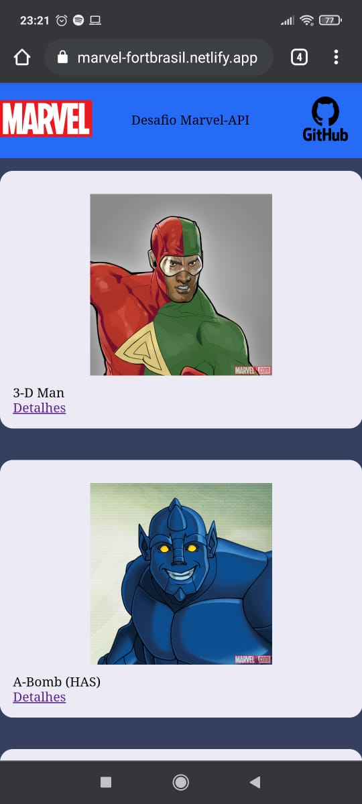

# Marvel
O Desafio: Marvel

<h1 align="center">
  
</h1>

<p align="center">
  

 
</p>

<br>

<p align="center">
  
  
</p>

## ✨ Tecnologias

Esse projeto foi desenvolvido com as seguintes tecnologias:

- [React](https://pt-br.reactjs.org/)
- [Typescript](https://www.typescriptlang.org/)
- [Styled Components](https://styled-components.com/)
- [Axios](https://github.com/axios/axios)

## 💻 Projeto

Aplicativo para Listar Herois da Marvel.


<p align="center">
  <a href="https://marvel-fortbrasil.netlify.app/" target="_blank">
    
  </a>
</p>


## 🔖 API

- 🔭 [API](https://api-marvel-fortbrasil.herokuapp.com/)
- 🔭 [Repo](https://github.com/IsakielSouza/PlantManager)

## 🚀 Como executar

- Clone o repositório
- Instale as dependências com `yarn`
- Execute comando `yarn start`

```bash
# Clone this repository
$ git clone https://github.com/lukemorales/react-rocketshoes

# Go into the repository
$ cd react-rocketshoes

# Install dependencies
$ yarn install

# Run the app
$ yarn start
```

## 📄 Licença

## :memo: License
Esse projeto está sob a licença MIT. Veja o arquivo [LICENSE](LICENSE.md) para mais detalhes.
